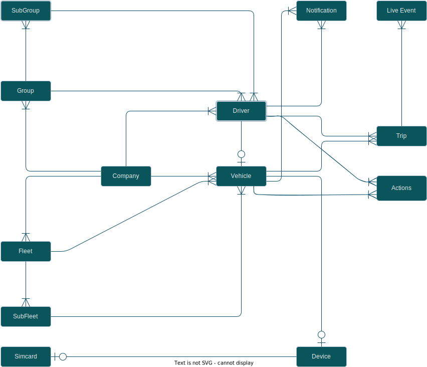

# TFM Project

This repo contains the backend code for TFM Project. It consists of two parts
- Super Admin Panel
- TFM Panel

For both parts we use the following AWS services :
- DynamoDB
- Cognito 
- Lambda
- Api Gateway
- CloudFormation

## Super Admin Entities
- [DTC Codes](#dtc-codes)

#### DTC Codes
- The super admin can create all DTC codes, they can fill them item by item or from excel file.
- These DTC Codes will be then used as a base of the dtc notifications and actions.

## TFM Features

- [Trip Details](#trip-details)
- [Driver Details](#driver-details)
- [Vehicle Details](#vehicle-details)
- [Drivers Overview](#drivers-overview)
- [Vehicles Overview](#vehicles-overview)
- [Dashboard](#dashboard)
- [Setting Page](#setting-page)
- [DTC Notifications](#dtc-notifications)
- [Actions](#actions)
#### Actions
- *Remide Me Later* : update the notification `status` attribute to be `pending` instead of `default`.
- *Schedule* : update the notification `status` attribute to be `schedule` instead of `default`.
- *Complete* : update the notification `status` attribute to be `done` instead of `default`.
- *Reshedule* : update the notification `status` attribute to be `schedule` instead of `pending`.
- *Complete after the notification gets out from inprogress state* : update the notification `status` attribute to be `done` instead of `pending`.


#### DTC Notifications

- The trip summary object contains `dtc` attribute and its value type is a string contains DTC Codes seperated by `commas`.

- Convert the dtc attribute to a list contains all dtc codes.
- Calculate  `dtc active score ` from the extracted list.
- loop through the list and 
update `totalDTCs` attribute in the vehicle with new dtcs codes.
- loop through the list and 
generate `DTC Notification` related to each code in the list.


#### Trip Details
- In each trip we calculate the driver score and the vehicle score  and showing them in the trip details page.
- The average scores for the vehicle and the driver will be updated after each trip and reflected in the trip details page.
- All trip statistics comes from flespi.
- Driver Compliance :
    - Max speed and Harsh events come from flespi statistics at the end of the trip.
    - The fuel efficiency is calculated as following :  `Fuel Efficiency = [Trip Distance / Trip Fuel Consumed * 100] / [Optimal Distance Per Vehicle / Optimal Fuel consumed Per Vehicle]`.
    - The duration that the driver used the seat belt divided by the trip duration multiplied by 100 will be the seat belt score.
    - Number of alerts comes from flespi.
    - Actionable notifications are the notifications that occure during the trip.
    - The rout comes from flespi at the end of the trip.
    - The starting point for knowing the driver name and the vehicle plate number is the device IMEI number that assigned to a vehicle.
 

#### Driver Details
- The driver score for each trip is calculated as following : 
    ```javascript 
        let _triptime = moment(payload.end_time).diff(moment(payload.start_time));
        let _timedelta = (_triptime - payload.idle_duration) / _triptime;
        let _odometer = Math.ceil(payload.odometer);
        let _raw_score = (_timedelta +	
        Math.abs(((0.75*_odometer - payload.high_braking_event) / _odometer)) +	
        Math.abs(((0.75*_odometer - payload.high_acceleration_event) / _odometer)) +	
        Math.abs(((0.75*_odometer - payload.overspeed.event) / _odometer))	
        Math.abs(((0.75*_odometer - payload.cornering.event) / _odometer)) /4
    ```
- The following is the equation for calculating driver score : 
    - $$
  {Ds} = \frac{w1*s1 + w2 * s2 + ...+ wn * sn}{w1+w2+...+wn} 
  $$
  >  where `Ds` referes to the daily driver score, `w` refers to the trip duration and `s` refers to the driver score in that trip. 
- `The daily score` will be reset at `12 AM ` Amman time zone.
- `The yesterday score` is updated before reset the daily driver score.
- `The weekly score` is updated before reset weekly statistics for each driver.
- `The current state `is updated either when the trip has been started `(Active)` or when the trip has been ended `(Available)`.
- `The last trip score of vehicle` is updated by the end of each trip.
- `The mileage` is caculated by accumulating the odometer for each trip.
- `The daily mileage` will be reset By the end of the day.
- `The monthly mileage` will be reset each month.
- `The annual mileage` will be reset each year.
- `The total number of trips` is increased by one at the end of each trip.
- `The driver tenure` is caculated by comparing the current date with the employment date.
- `Total Driver Distance` is calculated by accumulating the driver distance from the point the driver has started working in the concerned company.
- The `Average Trip Distance` is calculated by dividing the total driven Distance by the total number of trips.
- `Total Driving Duration ` is calculated by accumulating the trips duartions from the point the driver has started working in the concerned company.
- The `Average Trip Duration` is calculated by dividing the total Driving Duration by the total number of trips.
-  For each driver the overall rank and group rank are updated by the end of the day.
    - get all drivers and sort them in decending order by their life time score and assign them the correct rank 
    - get the drivers in each group and sort them in decending order by their life time score and assign them the correct group rank.
    - the last month for overall and group rank will be updated before reset monthly statistics for each driver.
- `Actionable notifications ` are the notifications that is related to the driver. Mostly they are registration notifications.
- `Scheduled notifications ` are the actionable notifications that the manager schedule them in the future to take action aginst them.
- `Inprogress notifications ` are the scheduled notifications that get in the time they should be processed against action.
`Pending notifications` are the notifications that the action `( Reminde Me later)` was taken against them `Or` they are the notifications that were in `Inprogress` status.

- `Driver Compliance` :
  > All driver compliance values can be filtered eithier yearly or monthly
  - `Max Speed`  : 
    - yearly :
     > `Max Speed = 100 -  [Yearly OverSpeed Summation / Yearly Driving Time ] * 100 `.

     > where `Yearly OverSpeed Summation` is the summation of all over speed durations that the driver exceeds the max speed limit configured either from vehicle or vehicle group. 
    - monthly :
     > `Max Speed = 100 -  [Monthly OverSpeed Summation / Monthly Driving Time ] * 100 `.

     > where `Monthly OverSpeed Summation` is the summation of all over speed durations that the driver exceeds the max speed limit configured either from vehicle or vehicle group. 

     > `Trips With Violations` is the number of trips where the driver violates the max speed limit.
  - `Seatbelt` :

     > `Seat Belt Percent =  [Yearly SeatBelt Summation / Yearly Driving Time ] * 100 `.

     > where `Yearly SeatBelt Summation` is the summation of all seatbelt durations where the driver has used the seatbelt. 
    - monthly :
     > `Seat Belt Percent =  [Monthly SeatBelt Summation / Monthly Driving Time ] * 100 `.

     > where `Monthly SeatBelt Summation` is the summation of all seatbelt durations where the driver has used the seatbelt.  

     > `Trips With Violations` is the number of trips where the driver violates the seat belt score configured from the driver group.
  - `Driving Hours` :
     - yearly :
     > `Driving Hours Percent = [ Yearly Driving Hours * 100] / [365 * Daily Working Hours]`.

     > Average Per Day is the yearly Driving Time In Hours / 365
    - monthly :
     > `Driving Hours Percent = [ Monthly Driving Hours * 100] / [30 * Daily Working Hours]`.

    > Average Per Day is the monthly Driving Time In Hours / 30


    > where `Daily Working Hours` is the number of hours that is configured from the driver group. 
  - `Fuel Efficiency` :
     - yearly :
     > `Fuel Efficiency = [Yearly Distance / Yearly Fuel Consumed * 100] / [Optimal Distance Per Vehicle / Optimal Fuel consumed Per Vehicle]`.
    - monthly :
     > `Fuel Efficiency = [Monthly Distance / Monthly Fuel Consumed * 100] / [Optimal Distance Per Vehicle / Optimal Fuel consumed Per Vehicle]`.
  	

#### Vehicle Details

- The vehicle score for each trip is calculated as following : 
    ```javascript 
       vehicle score per trip = 0.25 * Driver score per trip + 0.25 * DTCs Active + 0.25 * Distance Daily And Time daily + 0.25 * Maintenance Overdue;
    ```
    > `DTCs Active ` refers to whether a DTC code has happend within the vehicle in the trip or not.
    - `Distance Daily And Time daily ` composed of three parts :
    > The distance the vehicle travels each day.
    > The summation of idling time for all trips the vehicle travels each day.
    > the durations for all trips the vehicle  travels each day.
    - `Maintenance Overdue` composed of two parts :
    > The number of days that the vehicle exceeded the scheduled maintenance, whether it was time or distance.
    > The distance that the vehicle exceeded the scheduled maintenance, whether it was time or distance.

- The lifetime vehicle score for each trip is calculated as following : 
    ```javascript 
       lifetime vehicle score per trip = 0.25 * Average Driver score + 0.25 * DTCs History + 0.25 * Distance Odo And Time Age + 0.25 * Maintenance history overdue;
    ```
    > `DTCs History` refers to the total number of DTC codes that happened during the lifetime of vehicle.
    - `Distance Odo And Time Age ` composed of two parts :
    > The total mileage of the vehicle.
    > The age of the vehicle in years.
    - `Maintenance history Overdue` composed of two parts :
    > The number of months that the vehicle exceeded the scheduled maintenance, whether it was time or distance.
    > The distance that the vehicle exceeded the scheduled maintenance, whether it was time or distance.

- The following is the equation for calculating daily or lifetime vehicle score : 
    - $$
  {Vs} = \frac{w1*s1 + w2 * s2 + ...+ wn * sn}{w1+w2+...+wn} 
  $$
  >  where `Vs` referes to the daily vehicle score, `w` refers to the trip duration and `s` refers to the vehicle score in that trip. 
- `The daily score` will be reset at `12 AM ` Amman time zone.
- `The yesterday score` is updated before reset the daily vehicle score.
- `The weekly score` is updated before reset weekly statistics for each vehicle.
- `The current state `is updated either when the trip has been started `(Active)` or when the trip has been ended `(Available)`.
- `The last trip score of driver` is updated by the end of each trip.
- `The mileage` is caculated by accumulating the odometer for each trip.
- `The daily mileage` will be reset By the end of the day.
- `The monthly mileage` will be reset each month.
- `The annual mileage` will be reset each year.
- `The total number of trips` is increased by one at the end of each trip.
- `The current location` is updated at the end of each trip.
- `Total Mileage` is the total mileage of the vehicle.
- `Vehicle Age` is the current year minus the vehicle year.
- `Fuel Tank` is the remaining vehicle tank fuel.
- `Fuel Economy` refers to how the vehicle consumes fuel per 20 liters.
- `Avg Jd/Km` refers to the average consumed money per km.
- `Expense Analysis` refers to fuel, maintenance, renewal and tickets costs compared to the corresponding planned costs.
- `Next Service` :
>It shows the next service date, the remaining days of next service.
>next service Odometer, the remaining kms of next service.
>estimated cost amd time


- The `Average Trip Distance` is calculated by dividing the total driven Distance by the total number of trips.
- `Total Driven Time ` is calculated by accumulating the trips duartions from the point the vehicle has started working in the concerned company.
- The `Average Trip Duration` is calculated by dividing the total Driving Duration by the total number of trips.
-  For each driver the overall rank and group rank are updated by the end of the day.
    - get all drivers and sort them in decending order by their life time score and assign them the correct rank 
    - get the drivers in each group and sort them in decending order by their life time score and assign them the correct group rank.
    - the last month for overall and group rank will be updated before reset monthly statistics for each driver.
- `Actionable notifications ` are the notifications that is related to the vehicle.
- `Scheduled notifications ` are the actionable notifications that the manager schedule them in the future to take action aginst them.
- `Inprogress notifications ` are the scheduled notifications that get in the time they should be processed against action.
`Pending notifications` are the notifications that the action `( Reminde Me later)` was taken against them `Or` they are the notifications that were in `Inprogress` status.

#### Drivers Overview
- `The drivers score` is calculated as a weighted average of all drivers scores.
- `The daily score` will be reset at `12 AM ` Amman time zone.
- `The yesterday score` is updated before reset the daily driver score.
- `The weekly score` is updated before reset weekly statistics for the company.
- `The total drivers `is the total number of drivers in the company.
- `Active ` refers to the number of drivers they are currently in active trips.
- `Driven Mileage`:
    - `Today average` : is the sum of daily mileage of drivers divided by the number of the drivers and it will be reset at `12 AM ` Amman time zone.
    - `Monthly average` : is the sum of monthly mileage of drivers divided by the number of the drivers and it will be reset every new month.
    - `Annual average` : is the sum of Annual mileage of drivers divided by the number of the drivers and it will be reset every new year.
- `Drivers Compliance`:
    - `Fuel Efficiency ` : It is the sum of all `fuel efficiency percentages` of drivers divided by the total number of drivers and shows the lowest two drivers regarding fuel efficiency.
    - `Driving Hours` : It is the sum of all `driving hour percentages` of drivers divided by the total number of drivers and shows the highest two drivers regarding Driving Hours.
    - `Seatbelt` : It is the sum of all `seatbelt percentages` of drivers divided by the total number of drivers and shows the lowest two drivers regarding Seatbelt.
    - `Max Speed`: It is the sum of all `overspeed percentages` of drivers divided by the total number of drivers and shows the highest two drivers regarding Max Speed.
    > The Drivers Compliance can be filtered either yearly or monthly.
- `Actionable notifications ` are the notifications that is related to the drivers. Mostly they are registration notifications.
- `Scheduled notifications ` are the actionable notifications that the manager schedule them in the future to take action aginst them.
- `Inprogress notifications ` are the scheduled notifications that get in the time they should be processed against action.
`Pending notifications` are the notifications that the action `( Reminde Me later)` was taken against them `Or` they are the notifications that were in `Inprogress` status.

#### Vehicles Overview

- `The vehicles score` is calculated as a weighted average of all vehicles scores.
- `The daily score` will be reset at `12 AM ` Amman time zone.
- `The yesterday score` is updated before reset the daily vehicles score.
- `The weekly score` is updated before reset the weekly statistics for the company.
- `The total Vehicles `is the total number of Vehicles in the company.
- `Active ` refers to the number of Vehicles they are currently in active trips.
- `Running Mileage`:
    - `Today average` : is the sum of daily mileage of vehicles divided by the number of the vehicles and it will be reset at `12 AM ` Amman time zone.
    - `Monthly average` : is the sum of monthly mileage of vehicles divided by the number of the vehicles and it will be reset every new month.
    - `Annual average` : is the sum of Annual mileage of vehicles divided by the number of the vehicles and it will be reset every new year.
    - `Avg fleet ODO` : is the sum of the vehicles total mileage  divided by the number of the vehicles.
- `Vehicle Utilization`:
    - For single vehicle the utilization is computed as the daily vehicle trips time divided by the utilization target time configured in `vehicle info page` .
    - The current vehicles utilization is computed as the sum of daily vehicles utilization divided by the total number of vehicles.
    - The average vehicles utilization is computed as the sum of all vehicles utilization `in active days` divided by the number of active days.
    - If none of the vehicles have any trip in the current day then the current vehicle utilization will be `zero` and the average vehicles utilization will be the previous one.
    - the vehicles utilization is updated for every day and it is shown in the `TFM` as a chart represents all days for all quarters.
   
- `Avg Utilization` : it is the sum of all `vehicles trips time` converted to the proper format.
- `Avg Fleet Age` : it is the current date minus the average assigning dates for all vehicles.
- `Avg Model yaer` : It is the sum of all vehicles model years divided by the total number of vehicles.

- `Expenses Analysis`: 
    - It shows the current and the planned fuel expenses for all vehicles.
    - We represent the expenses analysis as a chart showing the current expenses for fuel and maintenance compared to the target planned expenses.

- `Actionable notifications ` are the notifications that is related to all `Vehicles` in the company.
- `Scheduled notifications ` are the actionable notifications that the manager schedule them in the future to take action aginst them.
- `Inprogress notifications ` are the scheduled notifications that enters in the time they should be processed against action.
- `Pending notifications` are the notifications that the action `( Reminde Me later)` was taken against them `Or` they are the notifications that were in `Inprogress` status.
 
    > The Drivers Compliance can be filtered either yearly or monthly.
#### Dashboard

- `The daily score for drivers and vehicles` is calculated as a weighted average of all daily scores.
- `The daily score for drivers and vehicles` will be reset at `12 AM ` Amman time zone.
- `The yesterday score for drivers and vehicles` is updated before reset the daily  scores for the company.
- `The weekly score for drivers and vehicles` is updated before reset the weekly statistics for the company.
- `The Drivers Statements` : They shows the factors that affect the daily drivers score and they will be enabled if the daily drivers score is less that 80.
- `The Vehicles Statements` : They shows the factors that affect the daily vehicles score and they will be enabled if the daily vehicles score is less that 80.

- `Vehicles Utilization` :
    - `Active` :  shows the the active vehicles percenatge out of the total vehicles.
    - `Available` : shows the the available vehicles percenatge out of the total vehicles.
    - `Stopped` : shows the the stopeed vehicles percenatge out of the total vehicles.

- `Expenses Anaylysis` : 
    - shows the daily maintenance and fuel expenses.
    - shows the current maintenance and fuel expenses out of the corresponding planned costs.

- `Daily Expenses` : 
    - shows the daily total expenses.
    - shows the daily fuel, maintenance, tickets, other  expenses.


- `Actionable notifications ` are the notifications that is related to all entities `( Drivers or Vehicles)` in the company.
- `Scheduled notifications ` are the actionable notifications that the manager schedule them in the future to take action aginst them.
- `Inprogress notifications ` are the scheduled notifications that enters in the time they should be processed against action.
- `Pending notifications` are the notifications that the action `( Reminde Me later)` was taken against them `Or` they are the notifications that were in `Inprogress` status.


#### Setting Page
- Here the toyota fleet manager can do the following :
    - `Creatde Driver`:
        - when creating a driver the `TFM` must choose the group the driver will belong to it. 
        - The driver should receive an invitation email contains the credentials that allow him to log in to the driver app.
    - `Create Vehicles Group` : 
        
        - When creating a vehicle group it is only required to provide the vehicle group name.
        - The default settings for the vehicle group when creating are :
            - `planned Fuel Expenses = zero`
            - `planned Fuel Expenses Per Vehicle = false`
            - `planned Maintenance Expenses = zero,`
            - `planned Maintenance Expenses Per Vehicle = false,`
            - `vehicle Utilization Target Hours = zero,`
            - `vehicle Utilization Target Minutes = zero,`
            - `max Speed Limit = zero,`
    - `Create Drivers Group`
        - When creating a driver group it is only required to provide the driver group name.
        - The default settings for the driver group when creating are :
            - `daily Working Hours = zero`
            - `daily Working Minutes = zero`
            - `seatBelt Score = zero`

    - `Assign and Unassign vehicles to group`.
        - By default when assigning vehicle to a company from the super admin we assign the vehicle to the default group.
        - The `TFM` can assign vehicle to another existing group.
        - when assigning a vehicle to another group different from `default` then the vehicle moved from `default` group to the desired group.
        - when unassigning a vehicle from a group different from `default` then the vehicle moved from desired group to the `default` group.
        - The TFM can fetch the vehicles assigned for each group.
    - `Assign and Unassign drivers to a group`
        - When creating a driver it is required to choose a group from the existing groups and this group will be the driver group.
        - The `TFM` can assign driver to another existing group.
        - when assigning a driver to another group different from `default` then the driver moved from `default` group to the desired group.
        - when unassigning a driver from a group different from `default` then the driver moved from desired group to the `default` group.
        - The TFM can fetch the drivers assigned for each group.
## dd

## Table of Contents

- [Super Admin Panel](#super-admin-panel)
- [Super Admin Access patterns](#super-admin-access-patterns)
<!-- - [Walkthrough](#walkthrough) -->
- [Table structure](#table-structure)


# Super Admin Access patterns

There are two 'twenty two' entities in this application. And there are many access patterns for those core entities:

**Clients:**

- **Create Client:** Available at `POST /admin/create/client`. Used to create a new Company. Will throw an error if  the companyname is already in our system.
- **Get Clients:** Available at `GET /admin/client/list`. Retrieve all Companies and core data. 
- **Update Client:** Available at `PATCH /admin/update/clientId/client`. Used to update an existing Company.
- **Remove Client:** Available at `PATCH /admin/client/delete/clientId`. Used to remove an existing Company.
- **Assign Vehicles to Client:** Available at `POST /admin/client/assign/clientId`. Used to assign and unassign one vehicle to an existing Company.
- **Get Assigned Vehicles:** Available at `GET /admin/client/listAssigned/clientId`. Retrieve all assigned vehicles for a specific company.


**Vehicles:**

- **Create Vehicle:** Available at `POST /admin/create/vehicle`. Used to create a new Vehicle.
- **Get Vehicles:** Available at `GET /admin/vehicle/list`. Retrieve all Vehicles and core data. 
- **Update Vehicle:** Available at `PATCH /admin/update/vehicleId/vehicle`. Used to update an existing vehicle.
- **Remove Vehicle:** Available at `PATCH /admin/vehicle/delete/vehicleId`. Used to remove an existing vehicle.
- **Assign Device to Vehicle:** Available at `POST /admin/vehicle/assign/vehicleId`. Used to assign and unassign one device to an existing vehicle.
- **Get all Unssigned Vehicles:** Available at `GET /admin/vehicle/listUnAssigned`. Retrieve all unassigned vehicles. 


**Devices:**

- **Create Device:** Available at `POST /admin/create/device`. Used to create a new Device.
- **Get Devices:** Available at `GET /admin/device/list`. Retrieve all Devices and core data. 
- **Update Device:** Available at `PATCH /admin/update/deviceId/device`. Used to update an existing device.
- **Remove Vehicle:** Available at `PATCH /admin/device/delete/deviceId`. Used to remove an existing device.
- **Assign Simcard to Device:** Available at `POST /admin/device/assign/deviceId`. Used to assign and unassign one simcard to an existing device.
- **Get all Unssigned devices:** Available at `GET /admin/device/listUnAssigned`. Retrieve all unassigned devices. 


**Simcards:**

- **Create Simcard:** Available at `POST /admin/create/simcard`. Used to create a new Simcard.
- **Get Simcards:** Available at `GET /admin/simcard/list`. Retrieve all Simcards and core data. 
- **Update Simcard:** Available at `PATCH /admin/update/simcardId/simcard`. Used to update an existing simcard.
- **Remove Simcard:** Available at `PATCH /admin/simcard/delete/simcardId`. Used to remove an existing simcard.
- **Get all Unssigned simcards:** Available at `GET /admin/simcard/listUnAssigned`. Retrieve all unassigned simcards. 

**DailyScore Weight:**
`we have just one item for this entity and we will use its values to control the daily vehicle score terms`
- **Create DailyScore:** Available at `POST /admin/create/daily-score`. Used to create the daily score item.
- **Get DailyScore:** Available at `GET /admin/daily-score/list`. Retrieve all daily score items. 
- **Update DailyScore:** Available at `PATCH /admin/update/dailyScoreId/daily-score`. Used to update the daily score item.
- **Remove DailyScore:** Available at `PATCH /admin/daily-score/delete/dailyScoreId`. Used to remove the daily score item.

**LifeTimeScore Weight:**
`we have just one item for this entity and we will use its values to control the LifeTime vehicle score terms`
- **Create LifeTimeScore:** Available at `POST /admin/create/lifetime-score`. Used to create the lifetime score item.
- **Get LifeTimeScore:** Available at `GET /admin/lifetime-score/list`. Retrieve all lifetime score items. 
- **Update LifeTimeScore:** Available at `PATCH /admin/update/lifetimeScoreId/lifetime-score`. Used to update the lifetime score item.
- **Remove LifeTimeScore:** Available at `PATCH /admin/lifetime-score/delete/lifetimeScoreId`. Used to remove the lifetime score item.


**LifeTimeScore Weight:**
`we have just one item for this entity and we will use its values to control the LifeTime vehicle score terms`
- **Create LifeTimeScore:** Available at `POST /admin/create/lifetime-score`. Used to create the lifetime score item.
- **Get LifeTimeScore:** Available at `GET /admin/lifetime-score/list`. Retrieve all lifetime score items. 
- **Update LifeTimeScore:** Available at `PATCH /admin/update/lifetimeScoreId/lifetime-score`. Used to update the lifetime score item.
- **Remove LifeTimeScore:** Available at `PATCH /admin/lifetime-score/delete/lifetimeScoreId`. Used to remove the lifetime score item.

**DailyDistance:**
`we have eleven items for this entity and we will use their values to calculate daily vehicle score based on the traveled distance for all daily trips`
- **Create DailyDistance:** Available at `POST /admin/create/daily-distance`. Used to create the daily distance item.
- **Get DailyDistance:** Available at `GET /admin/daily-distance/list`. Retrieve all daily distance items. 
- **Update DailyDistance:** Available at `PATCH /admin/update/dailyDistanceId/daily-distance`. Used to update the daily distance item.
- **Remove DailyDistance:** Available at `PATCH /admin/daily-distance/delete/dailyDistanceId`. Used to remove the daily distance item.

**DailyTime:**
`we have eleven items for this entity and we will use their values to calculate daily vehicle score based on the summation time for all daily trips`
- **Create DailyTime:** Available at `POST /admin/create/daily-time`. Used to create the daily time item.
- **Get DailyTime:** Available at `GET /admin/daily-time/list`. Retrieve all daily time items. 
- **Update DailyTime:** Available at `PATCH /admin/update/dailyTimeId/daily-time`. Used to update the daily time item.
- **Remove DailyTime:** Available at `PATCH /admin/daily-time/delete/dailyTimeId`. Used to remove the daily time item.


**DailyIdle:**
`we have eleven items for this entity and we will use their values to calculate daily vehicle score based on the summation of idling time for all daily trips`
- **Create DailyIdle:** Available at `POST /admin/create/daily-idle`. Used to create the daily idle item.
- **Get DailyIdle:** Available at `GET /admin/daily-idle/list`. Retrieve all daily idle items. 
- **Update DailyIdle:** Available at `PATCH /admin/update/dailyIdleId/daily-idle`. Used to update the daily idle item.
- **Remove DailyIdle:** Available at `PATCH /admin/daily-idle/delete/dailyIdleId`. Used to remove the daily idle item.


**MaintenanceOverDays:**
`we have four items for this entity and we will use their values to calculate daily vehicle score based on the number of days after the maintenance event happened and still there is no reponse to that event`
- **Create MaintenanceOverDays:** Available at `POST /admin/create/maintenance-over-days`. Used to create the MaintenanceOverDays item.
- **Get MaintenanceOverDays:** Available at `GET /admin/maintenance-over-days/list`. Retrieve all MaintenanceOverDays items. 
- **Update MaintenanceOverDays:** Available at `PATCH /admin/update/maintenanceOverDaysId/maintenance-over-days`. Used to update the MaintenanceOverDays item.
- **Remove MaintenanceOverDays:** Available at `PATCH /admin/maintenance-over-days/delete/maintenanceOverDaysId`. Used to remove the MaintenanceOverDays item.


**MaintenanceOverKM:**
`we have four items for this entity and we will use their values to calculate daily vehicle score based on the summation of traveled KM after the maintenance event happened and still there is no reponse to that event`
- **Create MaintenanceOverKM:** Available at `POST /admin/create/maintenance-over-km`. Used to create the MaintenanceOverKM item.
- **Get MaintenanceOverKM:** Available at `GET /admin/maintenance-over-km/list`. Retrieve all MaintenanceOverKM items. 
- **Update MaintenanceOverKM:** Available at `PATCH /admin/update/maintenanceOverKMId/maintenance-over-km`. Used to update the MaintenanceOverKM item.
- **Remove MaintenanceOverKM:** Available at `PATCH /admin/maintenance-over-km/delete/maintenanceOverKMId`. Used to remove the MaintenanceOverKM item.


**DTCActive:**
`we have five items for this entity and we will use their values to calculate daily vehicle score in case of the vehicle made dtc.`
- **Create DTCActive:** Available at `POST /admin/create/dtc-active`. Used to create the DTCActive item.
- **Get DTCActive:** Available at `GET /admin/dtc-active/list`. Retrieve all DTCActive items. 
- **Update DTCActive:** Available at `PATCH /admin/update/dtcActiveId/dtc-active`. Used to update the DTCActive item.
- **Remove DTCActive:** Available at `PATCH /admin/dtc-active/delete/dtcActiveId`. Used to remove the DTCActive item.


**LifetimeDistance:**
`we have eleven items for this entity and we will use their values to calculate lifetime vehicle score based on the cummulative traveled distance for all trips`
- **Create LifetimeDistance:** Available at `POST /admin/create/lifetime-distance`. Used to create the lifetime distance item.
- **Get LifetimeDistance:** Available at `GET /admin/lifetime-distance/list`. Retrieve all lifetime distance items. 
- **Update LifetimeDistance:** Available at `PATCH /admin/update/lifetimeDistanceId/lifetime-distance`. Used to update the lifetime distance item.
- **Remove LifetimeDistance:** Available at `PATCH /admin/lifetime-distance/delete/lifetimeDistanceId`. Used to remove the lifetime distance item.


**lifetimeAge:**
`we have six items for this entity and we will use their values to calculate lifetime vehicle score based on the age of vehicle.`
- **Create lifetimeAge:** Available at `POST /admin/create/lifetime-age`. Used to create the lifetime Age item.
- **Get lifetimeAge:** Available at `GET /admin/lifetime-age/list`. Retrieve all lifetime age items. 
- **Update lifetimeAge:** Available at `PATCH /admin/update/lifetimeAgeId/lifetime-age`. Used to update the lifetime age item.
- **Remove lifetimeAge:** Available at `PATCH /admin/lifetime-age/delete/lifetimeAgeId`. Used to remove the lifetime age item.


**MaintenanceHistoryMonths:**
`we have four items for this entity and we will use their values to calculate lifetime vehicle score based on the number of months after the maintenance event happened and still there is no reponse to that event`
- **Create MaintenanceHistoryMonths:** Available at `POST /admin/create/maintenance-history-months`. Used to create the MaintenanceHistoryMonths item.
- **Get MaintenanceHistoryMonths:** Available at `GET /admin/maintenance-history-months/list`. Retrieve all MaintenanceHistoryMonths items. 
- **Update MaintenanceHistoryMonths:** Available at `PATCH /admin/update/maintenanceHistoryMonthsId/maintenance-history-months`. Used to update the MaintenanceHistoryMonths item.
- **Remove MaintenanceHistoryMonths:** Available at `PATCH /admin/maintenance-history-months/delete/maintenanceHistoryMonthsId`. Used to remove the MaintenanceHistoryMonths item.


**MaintenanceHistoryKM:**
`we have four items for this entity and we will use their values to calculate lifetime vehicle score based on the summation of traveled KM after the maintenance event happened and still there is no reponse to that event`
- **Create MaintenanceHistoryKM:** Available at `POST /admin/create/maintenance-history-km`. Used to create the MaintenanceHistoryKM item.
- **Get MaintenanceHistoryKM:** Available at `GET /admin/maintenance-history-km/list`. Retrieve all MaintenanceHistoryKM items. 
- **Update MaintenanceHistoryKM:** Available at `PATCH /admin/update/maintenanceHistoryKmId/maintenance-history-km`. Used to update the MaintenanceHistoryKM item.
- **Remove MaintenanceHistoryKM:** Available at `PATCH /admin/maintenance-history-km/delete/maintenanceHistoryKmId`. Used to remove the MaintenanceHistoryKM item.


**TotalDTC:**
`we have five items for this entity and we will use their values to calculate lifetime vehicle score based on the total number of all dtc's that happent in the lifetime of vehicle.`
- **Create TotalDTC:** Available at `POST /admin/create/total-dtc`. Used to create the TotalDTC item.
- **Get TotalDTC:** Available at `GET /admin/total-dtc/list`. Retrieve all TotalDTC items. 
- **Update TotalDTC:** Available at `PATCH /admin/update/totalDTCId/total-dtc`. Used to update the TotalDTC item.
- **Remove TotalDTC:** Available at `PATCH /admin/total-dtc/delete/totalDTCId`. Used to remove the TotalDTC item.


**DriverNotification:**
`we use the driver notification items as a baseline to send a notification to the driver who exceeds the pre-defined number of events per trip.`
- **Create DriverNotification:** Available at `POST /admin/create/driver-notification`. Used to create the DriverNotification item.
- **Get DriverNotification:** Available at `GET /admin/driver-notification/list`. Retrieve all DriverNotification items. 
- **Update DriverNotification:** Available at `PATCH /admin/update/driverNotificationId/driver-notification`. Used to update the DriverNotification item.
- **Remove DriverNotification:** Available at `PATCH /admin/driver-notification/delete/driverNotificationId`. Used to remove the DriverNotification item.


**LicenseDate:**
`we have one license item with multiple thresholds to control sending vehicle notification before or after License Date has been expired .`
- **Create LicenseDate:** Available at `POST /admin/create/license-date`. Used to create the LicenseDate item.
- **Get LicenseDate:** Available at `GET /admin/license-date/list`. Retrieve all LicenseDate items. 
- **Update LicenseDate:** Available at `PATCH /admin/update/licenseDateId/license-date`. Used to update the LicenseDate item.
- **Remove LicenseDate:** Available at `PATCH /admin/license-date/delete/licenseDateId`. Used to remove the LicenseDate item.


**InsuranceDate:**
`we have one license item with multiple thresholds to control sending vehicle notification before or after Insurance Date has been expired .`
- **Create InsuranceDate:** Available at `POST /admin/create/insurance-date`. Used to create the InsuranceDate item.
- **Get InsuranceDate:** Available at `GET /admin/insurance-date/list`. Retrieve all InsuranceDate items. 
- **Update InsuranceDate:** Available at `PATCH /admin/update/insuranceDateId/insurance-date`. Used to update the InsuranceDate item.
- **Remove InsuranceDate:** Available at `PATCH /admin/insurance-date/delete/insuranceDateId`. Used to remove the InsuranceDate item.


**Items:**
- **Create Items:** Available at `POST /admin/create/items`. Used to create the Items item.
- **Get Items:** Available at `GET /admin/items/list`. Retrieve all `Items` items. 
- **Update Items:** Available at `PATCH /admin/update/itemId/items`. Used to update the `Items` item.
- **Remove Items:** Available at `PATCH /admin/items/delete/itemId`. Used to remove the `Items` item.


**VehicleTypes:**
- **Create Items:** Available at `POST /admin/create/vehicle-types`. Used to create the VehicleTypes item.
- **Get VehicleTypes:** Available at `GET /admin/vehicle-types/list`. Retrieve all VehicleTypes items. 
- **Update VehicleTypes:** Available at `PATCH /admin/update/vehicleTypeId/vehicle-types`. Used to update the VehicleTypes item.
- **Remove VehicleTypes:** Available at `PATCH /admin/vehicle-types/delete/vehicleTypeId`. Used to remove the VehicleTypes item.


# Table structure

The basic table structure is as follows:

- **Primary key:** `PK` & `SK`
- **GSI1 secondary index:** `GSI1PK` & `GSI1SK`
- **GSI2 secondary index:** `GSI2PK` & `GSI2SK`


And the entity chart for the table is:

| **Entity**    | **PK**                          | **SK**                          | **GSI1PK**        | **GSI1SK**        | **GSI2PK**        | **GSI2SK** |
|---------------|---------------------------------|---------------------------------|-------------------|-------------------|------|-------|
| Client      | `COMPANY#<CompanyName>`           | `COMPANY#<CompanyName>`           |      `COMPANY`              |         `COMPANY#<CompanyName>`          |
| Simcard | `SIMCARD#<SimcardId>`         | `SIMCARD#<SimcardId>`          |      `SIMCARD`            |    `UNASSIGNED`               |
| Vehicle         | `VEHICLE#<VehicleId>`           | `VEHICLE#<VehicleId>`            | `VEHICLE`| `VEHICLE#<VehicleId>`  | `VEHICLE`| `VEHICLE#<VehicleId>`  
| Device     | `DEVICE#<DeviceId>` | `DEVICE#<DeviceId>`  | `DEVICE` | `UNASSIGNED`   |
| Daily Score     | `DAILY-SCORE` | `DAILY-SCORE` | `DAILY-SCORE` | `DAILY-SCORE`
| LifeTime Score     | `LIFETIME-SCORE` | `LIFETIME-SCORE`  | `LIFETIME-SCORE` | `LIFETIME-SCORE`
| Daily Distance     | `DAILY-DISTANCE#<CreatedAt>` | `DAILY-DISTANCE#<CreatedAt>`  | `DAILY-DISTANCE` | `<CreatedAt>`
| Daily Time     | `DAILY-TIME#<CreatedAt>` | `DAILY-TIME#<CreatedAt>`  | `DAILY-TIME` | `<CreatedAt>`
| Daily Idle     | `DAILY-IDLE#<CreatedAt>` | `DAILY-IDLE#<CreatedAt>`  | `DAILY-IDLE` | `<CreatedAt>` 
| Maintenance OverDue Days    | `MAINTENANCE-OVER-DAYS#<CreatedAt>` | `MAINTENANCE-OVER-DAYS#<CreatedAt>`  | `MAINTENANCE-OVER-DAYS` | `<CreatedAt>`
| Maintenance OverDue KM    | `MAINTENANCE-OVER-KM#<CreatedAt>` | `MAINTENANCE-OVER-KM#<CreatedAt>`  | `MAINTENANCE-OVER-KM` | `<CreatedAt>`
| DTC Active    | `DTC-ACTIVE#<CreatedAt>` | `DTC-ACTIVE#<CreatedAt>`  | `DTC-ACTIVE` | `<CreatedAt>`
| LifeTime Distance    | `LIFETIME-DISTANCE#<CreatedAt>` | `LIFETIME-DISTANCE#<CreatedAt>`  | `LIFETIME-DISTANCE` | `<CreatedAt>`
| LifeTime Age    | `LIFETIME-AGE#<CreatedAt>` | `LIFETIME-AGE#<CreatedAt>` | `LIFETIME-AGE` | `<CreatedAt>`
| Maintenance History Months    | `MAINTENANCE-HISTORY-MONTHS#<CreatedAt>` | `MAINTENANCE-HISTORY-MONTHS#<CreatedAt>`  | `MAINTENANCE-HISTORY-MONTHS` | `<CreatedAt>`
| Maintenance History KM    | `MAINTENANCE-HISTORY-KM#<CreatedAt>` | `MAINTENANCE-HISTORY-KM#<CreatedAt>`  | `MAINTENANCE-HISTORY-KM` | `<CreatedAt>`
| Total DTC    | `TOTAL-DTC#<CreatedAt>` |`TOTAL-DTC#<CreatedAt>`  | `TOTAL-DTC` | `<CreatedAt>`
| Driver Notifications    | `DRIVER-NOTIFICATION#<NotificationSubType>` | `DRIVER-NOTIFICATION#<NotificationSubType>`  |`DRIVER-NOTIFICATION` | `<CreatedAt>`|
| Items   | `ITEMS#<ItemName>` | `ITEMS#<ItemName>`  |`ITEMS` | `<CreatedAt>`|
| Vehicle Types   | `VEHICLE-TYPES#<CreatedAt>` |  `VEHICLE-TYPES#<CreatedAt>` |`VEHICLE-TYPES` | `Make#Model#SubType#YearsRange`|
| License Date  | `LICENSE-DATE` | `LICENSE-DATE`  |`LICENSE-DATE` | `LICENSE-DATE`|
| Insurance Date  | `INSURANCE-DATE` | `INSURANCE-DATE`  |`INSURANCE-DATE` | `INSURANCE-DATE`|

    
## Entity Relationships   



